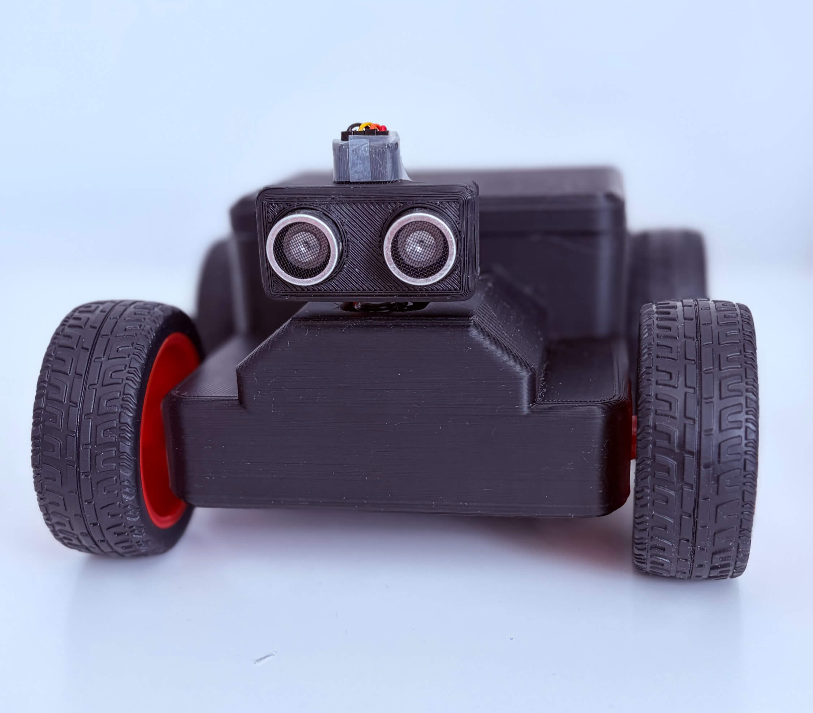
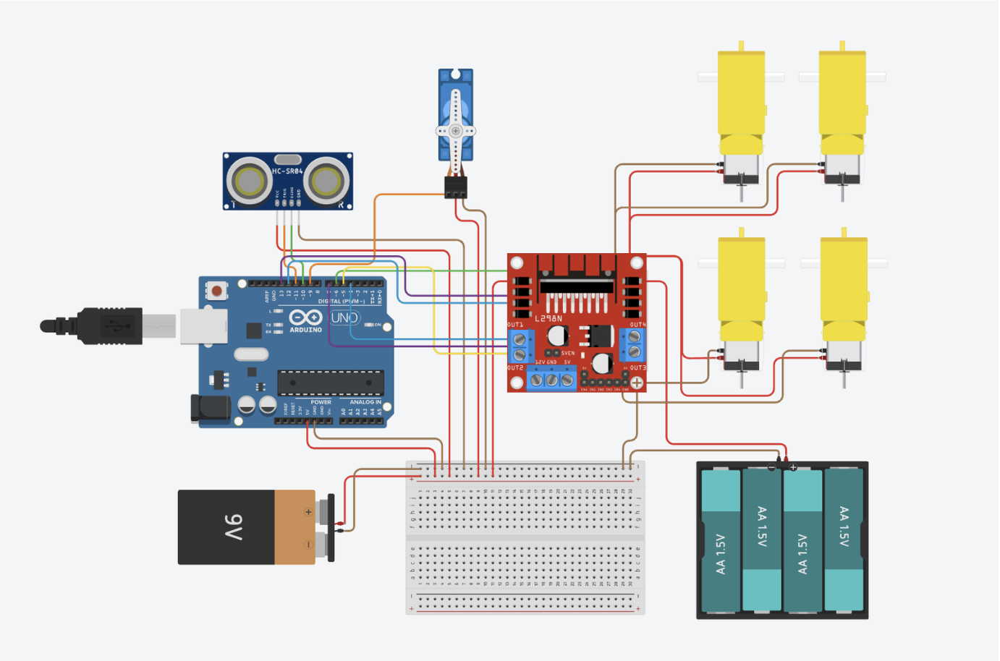
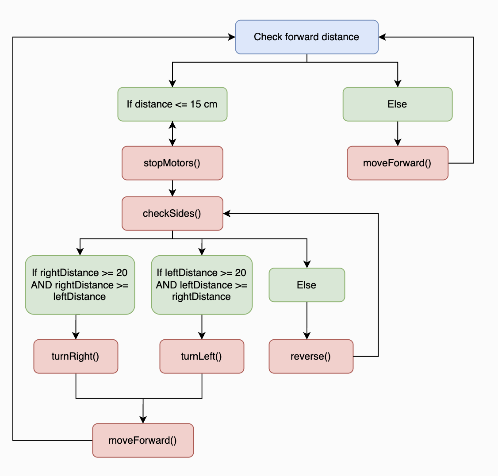

# Autonomous Mobile Robot

<p align="center">
  
</p>

An Arduino-based mobile robot developed to explore autonomous navigation,
embedded control and Bluetooth Low Energy communication.

**Portfolio:** [View the full project here](https://kmanuel27.github.io/project-autonomous-robot.html)

The robot supports three operating modes:

- **Manual** – direct user control from a desktop interface.
- **Assisted** – manual control with ultrasonic obstacle protection.
- **Autonomous** – reactive obstacle avoidance using an ultrasonic sensor
  mounted on a servo.

The final control interface was developed in **Python**, using **Tkinter** for the GUI and **Bleak** for Bluetooth Low Energy communication.

## Features

- Autonomous obstacle detection and avoidance
- Servo-mounted ultrasonic environmental scanning
- Manual remote driving
- Assisted driving with forward collision prevention
- Bluetooth Low Energy communication
- Python desktop control interface
- Connection status and error handling
- Adjustable motor speed and obstacle detection thresholds

## Hardware

- Arduino Uno R3
- L298N dual H-bridge motor driver
- 4 × 6 V TT DC geared motors
- HC-SR04 ultrasonic distance sensor
- SG90 micro servo motor
- HM-10 Bluetooth Low Energy (BLE) module
- 3D-printed PLA chassis
- 6 × AA battery holder
- 9 V battery
- Power switch

## System Overview

The system consists of an Arduino-based mobile platform controlled either by
its onboard autonomous navigation algorithm or through a Python desktop
controller.

The Python application uses:

- **Tkinter** for the graphical user interface
- **Bleak** for Bluetooth Low Energy communication
- **asyncio** for asynchronous BLE operations
- **threading** to separate Bluetooth communication from the GUI

Movement and mode commands are transmitted to an HM-10 BLE module, which
forwards them to the Arduino over serial.

### Electrical Architecture

<p align="center">
  
</p>

## Operating Modes

### Manual

The user directly controls forward, reverse, left and right movement from the
Python interface. Releasing a movement button sends a stop command to the
Arduino.

### Assisted

Assisted mode retains direct user control while continuously monitoring the
ultrasonic sensor. Forward movement is prevented when an obstacle is detected
within the defined safety distance.

### Autonomous

The robot continuously measures the distance ahead.

When an obstacle is detected, the robot stops and rotates the ultrasonic sensor
using a servo to measure the available space on either side. It then turns
towards the clearer path or reverses if neither side provides sufficient
clearance.

### Autonomous Navigation Logic

The autonomous navigation logic is summarised in the flowchart below.

<p align="center">
  
</p>

## Software Architecture

```text
Python Controller
Tkinter + Bleak
       |
       | Bluetooth Low Energy
       v
     HM-10
       |
       | Serial
       v
     Arduino
     /     \
    /       \
Motors    Sensors
           |
     Ultrasonic + Servo
```

## Repository Structure

```text
Autonomous-Robot/
├── arduino/
│   └── autonomous_robot.ino
├── controller/
│   └── robot_controller.py
├── docs/
│   ├── finalRobot.png
│   ├── software_diagram.png
│   └── electrical_diagram.png
└── README.md
```

## Future Improvements

- **Mapping and localisation** – integrate a LiDAR or Time-of-Flight sensor to construct a 2D map of the surrounding environment, with wheel encoders to improve position estimation.
- **Chassis redesign** – increase internal clearance, improve cable routing and make the electronics easier to access.
- **Communication failsafe** – implement a heartbeat or watchdog system so the motors automatically stop if the Bluetooth connection is unexpectedly lost.
